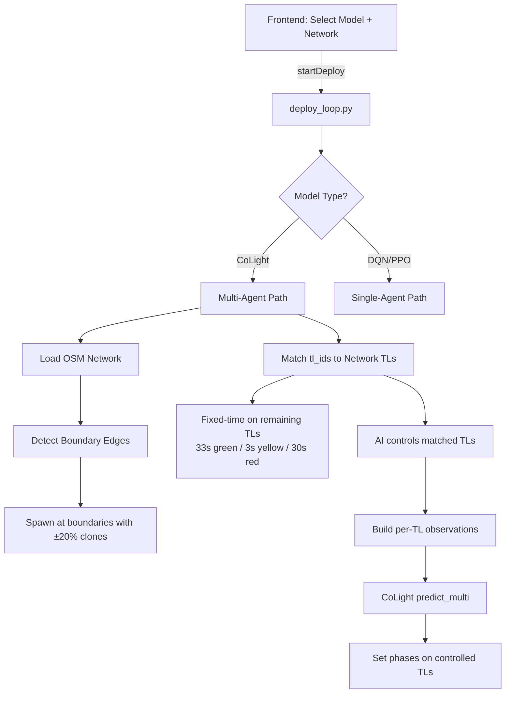

# Multi-Agent Deploy Support

## Summary
Added support for multi-agent (CoLight) model deployment in the Digital Twin deploy pipeline. Previously only single-agent DQN/PPO models were supported.

## Changes Made

### 1. `services/digital_twin/service/rl_model.py` — **Rewritten**
- Added `ColightNet`, `EmbeddingMLP`, `MultiHeadGraphAttention` modules (mirrors backend training architecture)
- `RLModel.load()` now detects `algorithm: "colight"` and loads the full graph-based model with adjacency matrix
- Added `predict_multi(observations)` → returns per-intersection actions
- New fields: `is_multi_agent`, `num_intersections`, `phase_lengths`, `adj_matrix`, `tl_ids`

### 2. `services/digital_twin/service/deploy_loop.py` — **Rewritten**
Key changes for the 3 deployment requirements:

#### Network Generation (Requirement 1)
- Uses saved OSM network (`SAVED_NETWORKS_DIR/{network_id}.net.xml`) when `network_id` is provided
- Falls back to grid network generation if not found
- Detects boundary edges in OSM networks for vehicle spawning

#### Spawning Logic (Requirement 2)
- Video tracking applies spawn logic to detect vehicles at one intersection
- Each spawn event is **cloned** to other boundary entry edges with **±20% deviation**
  - 80% probability each clone spawns (controlled by `SPAWN_CLONE_DEVIATION = 0.20`)
- Vehicles only spawn at boundary (edge) entry points

#### Multi-Agent Control (Requirement 3)
- Loads model, checks `is_multi_agent` flag
- **AI-controlled intersections**: Model's `tl_ids` matched against the network's available TLs
- **Uncontrolled intersections**: Fixed-time control installed: **33s green → 3s yellow → 30s red** per direction
- Builds per-intersection observations and calls `predict_multi()` for joint CoLight action selection
- Falls back gracefully if trained TL IDs aren't in the network

### 3. `services/digital_twin/service/sumo_manager.py` — **Extended**
- `start()` now accepts optional `route_file` parameter
- `get_all_tl_ids()` — returns all traffic light IDs
- `get_all_traffic_light_states()` — returns state dict for ALL TLs
- `install_fixed_time_on_all(exclude_tl_ids)` — applies fixed timing to all TLs except excluded ones
- `build_observation_for_tl(tl_id, num_actions)` — builds per-intersection observation matching training format

### 4. `services/digital_twin/service/main.py` — **Updated**
- `DeployStartRequest` now includes `tl_ids: list[str] | None`

### 5. `frontend/src/services/digitalTwinDeployService.ts` — **Updated**
- `DeploySnapshot` and `DeployStatus` interfaces now include multi-agent fields
- `startDeploy()` passes `tl_ids` to backend

### 6. `frontend/src/pages/DigitalTwinDeployPage.tsx` — **Updated**
- Shows **Mode** badge (Multi-Agent / Single-Agent) with distinct colors
- Displays **AI-Controlled** vs **Fixed-Time** intersection counts
- Traffic Light State panel shows per-intersection phases with **AI** / **Fixed** badges
- Last Action shows per-TL actions for multi-agent mode

## Architecture Flow

